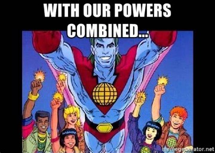
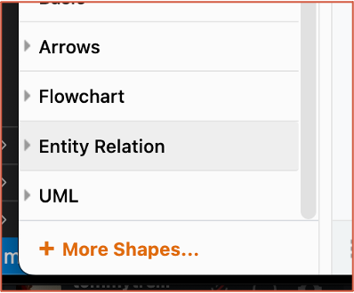
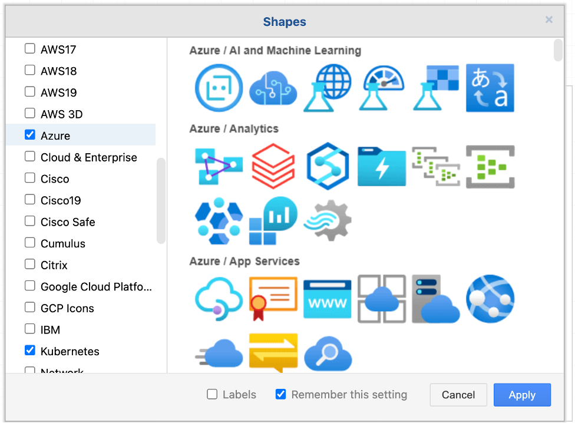

<!--
_class: lead invert
-->

# **Reusable architecture diagrams**
## with Draw.io + VSCode + GitHub + MARP

### Presented by: Tommy Falgout

---

# My Goal

By end of this session you will, _not just learn about_, but be interested in using these processes and tools to help you make a bigger impact in your career.

---

# Agenda

- The Gift of Your Keystrokes
- Technology
- Live Demo

---

# Our Time Is Limited


- [Gift of Your Keystrokes by Scott Hanselman](https://www.hanselman.com/blog/do-they-deserve-the-gift-of-your-keystrokes)

```5.1CPW * 50WPM * 60m/hr * 6hr/s a day * 5 days/wk * 50 wks/year * 44yrs = 1,009,800,000 keystrokes left in your hands```

- Effectiveness vs. Efficiency
  - When we reply via email, we reach 1-10 people
  - If we expand reach (e.g. blog), we can increase impact
- Focus on ROI of the limited keystrokes

<!--
We've heard there are 525,600 minutes in a year.
Convert that time to keystrokes, what are you doing with them?
effectiveness - aka: impact
Makes for good connect-glitter to showcase your impact.
-->
--- 

# diagrams.net (aka draw.io)

- Open Source Diagram Software
- Integrates with: Teams, G-Drive, Confluence, GitHub
- Import Shapes: Azure, AWS, UML
- Suports: Browser, Native App, VSCode


<!--
Under the hood, draw.io diagrams are XML
-->
--- 

# VS Code

- File Editor
- Vast plugin ecosystem
    - Including Draw.io


---

# GitHub

- Version Control as a Service
- Works best for text, NOT binary
- Uses Markdown for documentation


---

# MARP - Markdown Presentation

- Convert Markdown a presentation
- Use [GitHub action to update GH Pages & PDF](https://github.com/lastcoolnameleft/reusable-architecture-diagrams/blob/main/.github/workflows/marp-to-pages.yml)
- Example: [This repo!](https://github.com/lastcoolnameleft/reusable-architecture-diagrams)


<!--
Meta screenshot.  Me editing this presentation
-->
---
# Putting It All Together

- Use Draw.io to create diagrams
- Use VSCode to create documentation
- Use Marp to present
- Use Github to store and version control



--- 

<!--
_backgroundColor: black
_class: lead
-->

# **Case Study**

---

# Partner Requirements

- SaaS Offer
- AKS
- Microservices
- K8S Ingress
- Private Link across Tenants

---

# VSCode + Draw.io


---

# GitHub + Markdown


HINT: Does this look familiar?

--- 

# Blog

Maximize your keystrokes!


<!--
Had ~800 views from this.  WAY more than the 10 people I would have reached if I had just responded.
YES, took more time.  But if you can do this consistently, it gets easier.
Builds good muscle.
-->

---

<!--
_backgroundColor: black
_class: lead
-->

# **Draw.io Tips and Tricks**

--- 

# Add More Shapes



<!--
I assume you know how to write markdown and how to post a blog.
-->

--- 

# Add Azure Shapes



Other shapes include:
- Other Clouds (AWS/GCP/IBM)
- VMWare
- Office
- Network
- Logic Gates

---

# Important to know

- Draw.io works in layers
- Click X on shape to add connectors
- Double-click on shape to add text
- Click any blank area to add text
  - Can add text to connectors
- Zoom and pan with mouse

## [Quick start guide](https://www.youtube.com/watch?v=Z0D96ZikMkc)

---

# Style Recommendations

  - Draw containers from large (back) to small (front)
  - Example:
    - Tenant
    - Subscription
    - Vnet
    - Subnet
    - AKS
- Place icon in top left

---

<!--
_backgroundColor: black
_class: lead
-->

# **DEMO TIME**

---

<!--
_backgroundColor: black
_class: lead
-->

# **F-IT!  Let's do it live!**

---

<!-- 
_footer: 'Credit: [foo](https://www.youtube.com/watch?v=bEzbCP9wtB0)'
-->

# Volunteers?

- Walk me through your
  - Example architecture
  - Azure based
- I'll draw your architecture
 


---

<!--
_backgroundColor: black
_class: lead
-->
<style scoped>
h1 {
  color: white;
}
h3 {
  position: absolute;
  left: 600px;
  bottom: 130px;
  color: white;
}
h4 {
  position: absolute;
  left: 600px;
  bottom: 90px;
  color: yellow;
}
h5 {
  position: absolute;
  left: 600px;
  bottom: 70px;
  color: yellow;
}
</style>

# Thanks for attending!
## Let me know how this impacts you!
### Tommy Falgout
#### Cloud Solution Architect
