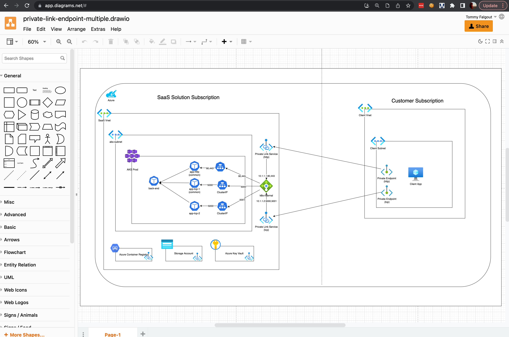
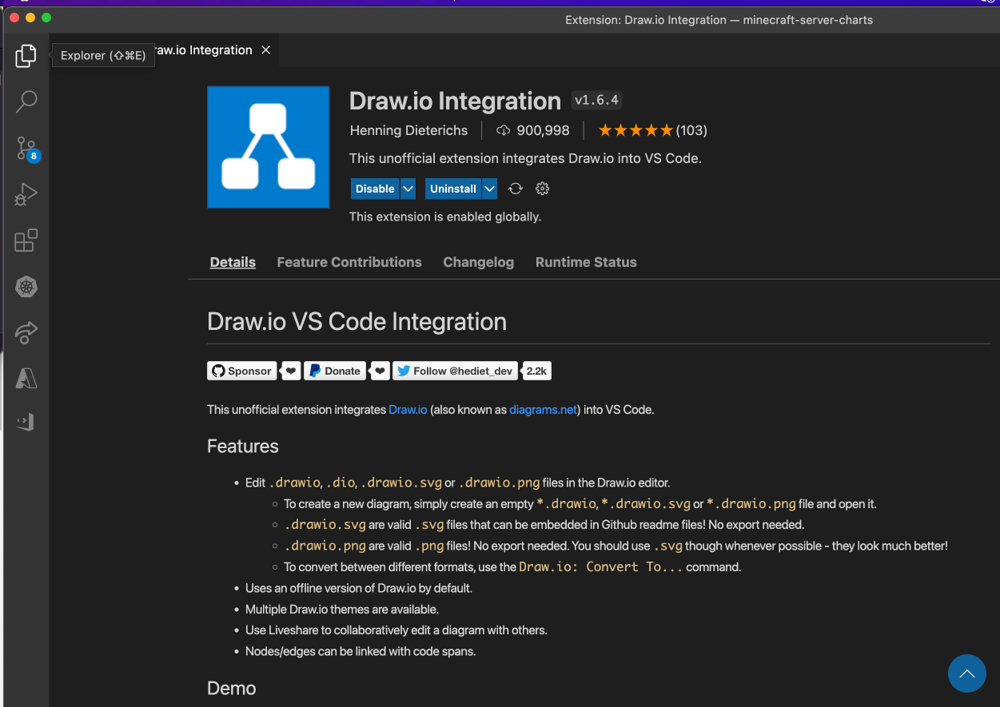
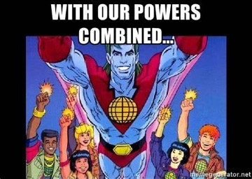
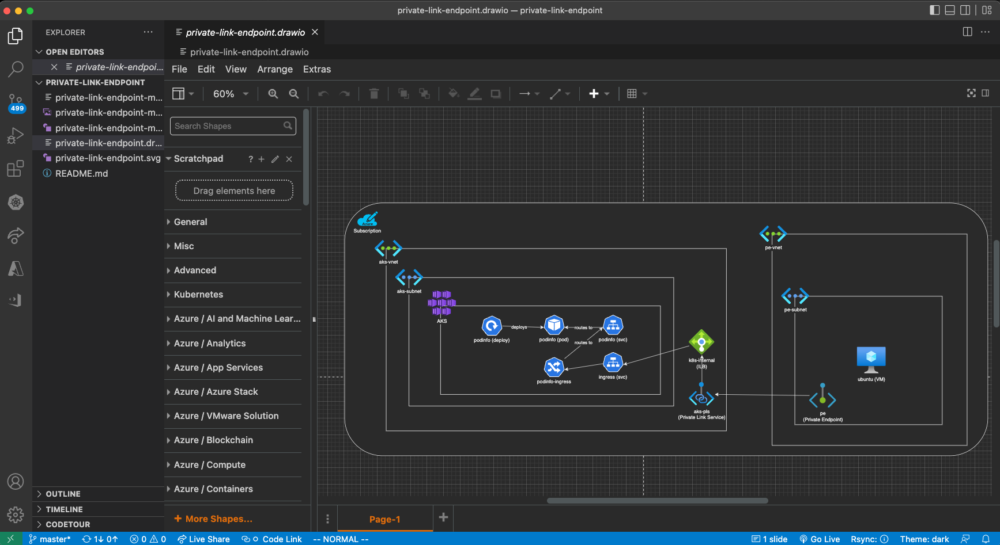
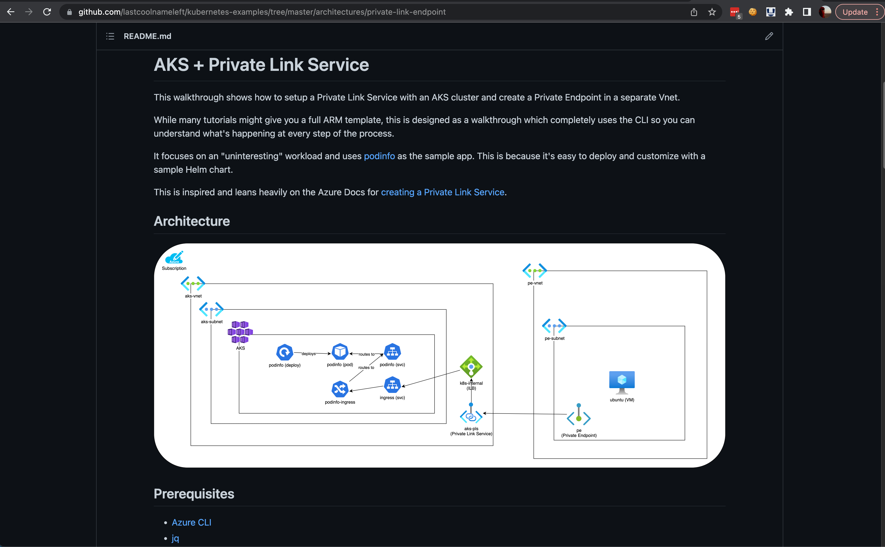
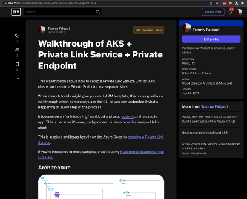
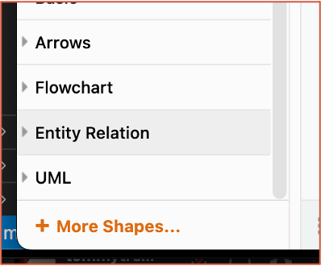
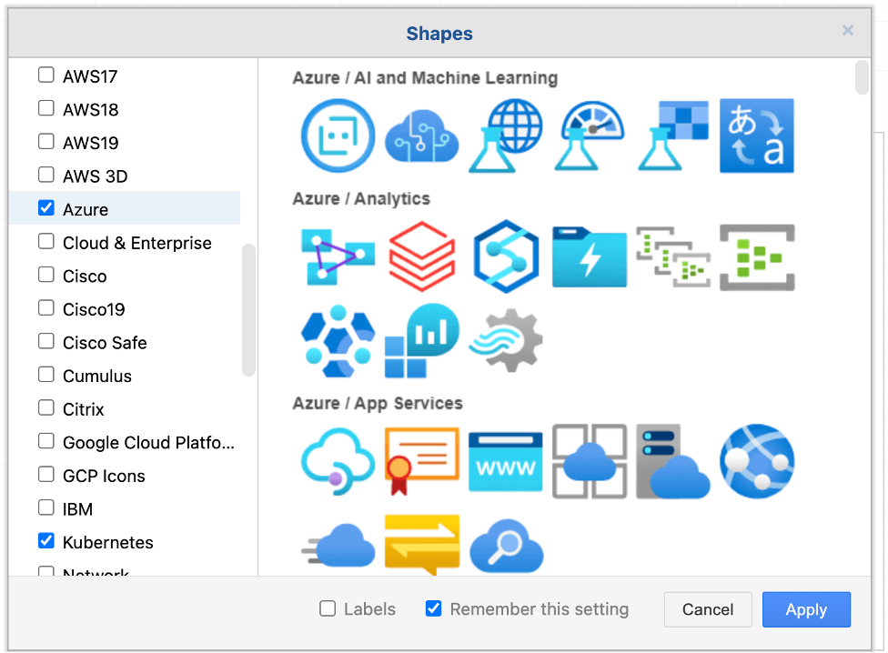

<!--
_backgroundColor: black
_class: lead
-->

# **Reusable architecture diagrams**
## with Draw.io + VSCode + GitHub

## Presented by: Tommy Falgout and lots of hands-on experience

---

# Agenda

- Overview
- The Gift of Your Keystrokes
- Technology
  - Draw.io
  - VSCode
  - Github
- Live Demo

---

# Our Time Is Limited


- [Gift of Your Keystrokes by Scott Hanselman](https://www.hanselman.com/blog/do-they-deserve-the-gift-of-your-keystrokes)

```5.1CPW * 50WPM * 60m/hr * 6hr/s a day * 5 days/wk * 50 wks/year * 44yrs = 1,009,800,000 keystrokes left in your hands```

- Effectiveness vs. Efficiency
  - When we reply via email, we reach 1-10 people
  - If we blog, we can increase reach
- Focus on ROI of the limited keystrokes

--- 

# Draw.io 

- Open Source Diagram Software
- Integrates with:
  - MS Teams, Google Drive, Confluence, GitHub
- Import Shapes (Azure, AWS, UML)
- Can use: Browser, Native App, VSCode




--- 

# VS Code

- File Editor
- Vast plugin ecosystem
    - Including Draw.io



---

# GitHub

- Version Control as a Service
- Works best for text, NOT binary
- Uses Markdown for documentation


---

# Putting It All Together

- Use Draw.io to create diagrams
- Use VSCode to create documentation
- Use Github to store and version control



--- 

<!--
_backgroundColor: black
_class: lead
-->

# **Case Study**

---

# Requirements

- SaaS Offer
- AKS
- Microservices
- K8S Ingress
- Private Link across Tenants

---

# VSCode + Draw.io




---

# GitHub + Markdown



HINT: Does this look familiar?

--- 

# Blog

Maximize your keystrokes!



---

<!--
_backgroundColor: black
_class: lead
-->

# **Draw.io Tips and Tricks**

--- 

# Add More Shapes



--- 

# Add Azure Shapes



Other shapes include:
- AWS
- GCP
- IBM
- VMWare
- Office
- Network
- Logic Gates

---

# Important to know

- Draw.io works in layers
  - Draw containers from large to small
  - Example:
    - Tenant
    - Subscription
    - Vnet
    - Subnet
    - AKS
- Place icon in top left, inside the container

---

<!--
_backgroundColor: black
_class: lead
-->

# **DEMO TIME**
# **F-IT!  Let's do it live!**

---

<!-- 
_footer: 'Credit: https://www.youtube.com/watch?v=bEzbCP9wtB0'
-->

# Volunteers?

- Walk me through your
  - Example architecture
  - Azure based
- I'll draw your architecture
 


---

<!--
_backgroundColor: black
_class: lead
-->
<style scoped>
h1 {
  color: white;
}
h3 {
  position: absolute;
  left: 600px;
  bottom: 130px;
  color: white;
}
h4 {
  position: absolute;
  left: 600px;
  bottom: 90px;
  color: yellow;
}
h5 {
  position: absolute;
  left: 600px;
  bottom: 70px;
  color: yellow;
}
</style>

# Thanks for attending!
## Please fill out a session evaluation
### Tommy Falgout
#### Cloud Solution Architect